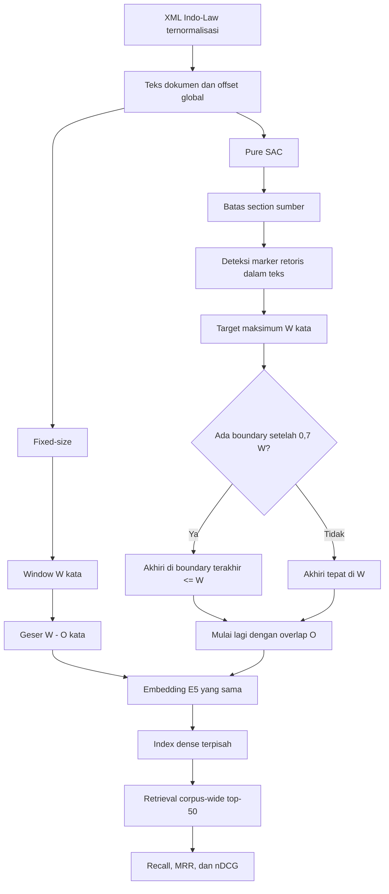

# Perancangan Pure SAC v2 dan perbaikan dataset

Tanggal: 7 Oktober 2026  
Status: kandidat *post-hoc development*; holdout tidak digunakan

## Keputusan singkat

Pure SAC v2 tetap murni karena teks yang di-embedding hanya substring dokumen
asli. Algoritma tidak menambahkan nama terdakwa, heading buatan, konteks parent,
filter section saat query, atau reranker. Perubahannya hanya memilih batas akhir
window berdasarkan marker retoris hukum yang memang terdapat dalam teks.

Hasil development belum mendukung penggantian Pure SAC lama secara menyeluruh.
Pada ukuran 300/60, SAC v2 memperbaiki Recall@5 `pertimbangan_hukum` dari 0,5500
menjadi 0,5750 dan Recall@10 dari 0,6750 menjadi 0,7000. Namun MRR@5 turun dari
0,1812 menjadi 0,1729, dan fixed 300/60 masih lebih tinggi pada Recall@5
(0,8000). Selisih Recall@5 SAC v2 berasal dari empat kueri membaik dan tiga
kueri memburuk dari 40 kueri. Karena itu hasil ini harus disebut peningkatan
deskriptif kecil, bukan bukti keunggulan atau hasil final.

## Batas definisi Pure SAC

Kandidat dianggap Pure SAC hanya jika memenuhi seluruh syarat berikut:

1. chunk tidak melintasi section sumber;
2. `chunk.text` merupakan substring persis dokumen dan offset dapat diverifikasi;
3. `embedding_text` tidak diberi prefix atau konteks tambahan;
4. boundary tidak bergantung pada isi query;
5. retrieval tidak memakai filter section, document filter, atau reranker;
6. model embedding, normalisasi, top-K, dan corpus scope sama dengan fixed-size.

`configs/structure_aware_pure_v2.yaml` mengunci
`embedding_context: none`, `boundary_mode: legal_rhetorical`, ukuran 300 kata,
overlap 60 kata, dan rasio isi minimum 0,7. Kontrol yang tepat berpasangan ada
di `configs/fixed_size_matched.yaml` dengan ukuran 300 dan overlap 60 yang sama.

## Arsitektur yang dibandingkan

Keterangan: `W` adalah `max_words`; `O` adalah `overlap_words`. Pada semua
pasangan, `O = 20% W`.

## Algoritma boundary-aligned

Untuk setiap section yang panjang:

1. tokenisasi posisi kata dilakukan tanpa mengubah teks;
2. marker seperti `Menimbang bahwa`, `Terhadap unsur`, `Oleh karena itu`,
   keadaan memberatkan/meringankan, dan marker amar dicari dalam teks asli;
3. dari posisi awal `s`, batas keras ditetapkan pada `s + W`;
4. boundary retoris terakhir dalam interval
   `[s + ceil(0,7 W), s + W]` dipilih; jika tidak ada, dipakai batas keras;
5. chunk disimpan dengan teks dan offset sumber persis;
6. posisi awal berikutnya adalah `end - O`;
7. ekor yang sangat pendek di-*backfill* dari section yang sama, tetap maksimal
   `W` kata.

Syarat isi minimum 70% mencegah marker yang berdekatan menghasilkan banyak
chunk pendek. Percobaan awal yang melakukan packing per unit retoris ditolak
karena menaikkan jumlah chunk 150/30 dari 2.457 menjadi 3.092 dan menurunkan
Recall@5 `pertimbangan_hukum` menjadi 0,1000. Implementasi final
boundary-aligned menghasilkan 2.526 chunk, jauh lebih dekat dengan SAC lama.

## Fairness fixed-size versus SAC

Fixed-size tidak dibuat sengaja lemah. Kedua keluarga diuji pada grid yang sama:

| Ukuran | Overlap | Fixed | Pure SAC lama | Pure SAC v2 |
|---:|---:|---|---|---|
| 150 | 30 | `fixed_w150_o30` | `sac_w150_o30_s0` | `sac2_w150_o30_rhet` |
| 300 | 60 | `fixed_w300_o60` | `sac_w300_o60_s0` | `sac2_w300_o60_rhet` |
| 500 | 100 | `fixed_w500_o100` | `sac_w500_o100_s0` | `sac2_w500_o100_rhet` |

Semua memakai `intfloat/multilingual-e5-small`, prefix E5 yang sama, embedding
ternormalisasi, pencarian full-corpus, dan `top_k=50`. Angka latency lintas run
tidak dibandingkan karena proses dibuat pada sesi berbeda.

## Hasil development

### Agregat 160 kueri

| Konfigurasi | Chunk | Recall@5 | MRR@5 | nDCG@5 | Recall@10 | Recall@50 |
|---|---:|---:|---:|---:|---:|---:|
| Fixed 150/30 | 2.341 | 0,6562 | 0,3622 | 0,3492 | 0,8063 | 0,8938 |
| SAC lama 150/30 | 2.457 | 0,6687 | 0,4146 | **0,4587** | 0,7250 | 0,8125 |
| SAC v2 150/30 | 2.526 | 0,6375 | 0,3939 | 0,4279 | 0,7000 | 0,7688 |
| Fixed 300/60 | 1.173 | 0,6562 | 0,3914 | 0,3779 | 0,7562 | 0,8688 |
| SAC lama 300/60 | 1.346 | 0,6500 | **0,4322** | 0,4554 | 0,7750 | **0,8938** |
| SAC v2 300/60 | 1.385 | **0,6625** | 0,4303 | **0,4572** | **0,7750** | 0,8875 |
| Fixed 500/100 | 710 | **0,6500** | **0,4315** | **0,4168** | **0,7438** | **0,9187** |
| SAC lama 500/100 | 923 | 0,6125 | 0,4255 | **0,4441** | 0,6875 | **0,8750** |
| SAC v2 500/100 | 947 | 0,5938 | 0,4127 | 0,4410 | **0,7000** | 0,8500 |

Cetak tebal membandingkan SAC lama-v2 di dalam ukuran yang sama; pada baris
fixed, cetak tebal menunjukkan fixed terbaik untuk metrik tersebut.

### Khusus `pertimbangan_hukum` (40 kueri)

| Ukuran | Metode | Recall@5 | MRR@5 | nDCG@5 | Recall@10 | Recall@50 |
|---:|---|---:|---:|---:|---:|---:|
| 150/30 | Fixed | 0,7500 | 0,5079 | 0,2456 | 0,8000 | 0,8250 |
| 150/30 | SAC lama | 0,2250 | 0,0958 | 0,0530 | 0,3000 | 0,4750 |
| 150/30 | SAC v2 | 0,1750 | 0,0483 | 0,0321 | 0,2000 | 0,3000 |
| 300/60 | Fixed | **0,8000** | **0,5279** | **0,2991** | **0,8250** | **0,9000** |
| 300/60 | SAC lama | 0,5500 | 0,1812 | 0,1498 | 0,6750 | **0,8500** |
| 300/60 | SAC v2 | **0,5750** | 0,1729 | 0,1494 | **0,7000** | 0,8250 |
| 500/100 | Fixed | 0,7000 | 0,3937 | 0,2393 | 0,7750 | 0,9500 |
| 500/100 | SAC lama | **0,4500** | **0,1571** | **0,1176** | 0,5250 | **0,8250** |
| 500/100 | SAC v2 | 0,3750 | 0,1038 | 0,1039 | **0,5500** | 0,7500 |

Implikasi desain:

- jika tujuan seleksi utama tetap nDCG@5 keseluruhan, Pure SAC lama 150/30
  tetap kandidat terbaik;
- jika analisis eksploratif memprioritaskan coverage pertimbangan pada pasangan
  300/60, SAC v2 memberi peningkatan kecil;
- fixed 300/60 tetap jauh lebih baik untuk pertimbangan hukum;
- jangan menyatakan SAC v2 "menyelesaikan" masalah reasoning.

## Mengapa Pure SAC tetap tertinggal pada pertimbangan hukum

Sebanyak 13 dari 40 draft pertanyaan statute menyebut identitas yang tidak
muncul di section evidence. Fixed-size boleh melintasi batas section sehingga
sebagian chunk membawa petunjuk identitas dokumen. Pure SAC menjaga section
secara ketat, sehingga chunk pasal yang generik sulit dikaitkan dengan nama
terdakwa di query. Menambahkan identitas parent dapat memperbaiki masalah ini,
tetapi itu adalah contextual SAC dan berada di luar keputusan Pure SAC.

## Dataset v2

Benchmark lama membuat satu pertanyaan administratif per dokumen: tempat lahir
dipakai jika berhasil, sedangkan riwayat penahanan hanya menjadi fallback.
Akibatnya development lama memiliki 39 kueri `identitas_terdakwa` tetapi hanya
satu kueri `riwayat_penahanan`; skor section penahanan tidak representatif.

Generator baru membuat setiap keluarga secara independen dan menyimpan:

- `question_type`;
- `target_section_label` semantik;
- `evidence_section_label` aktual;
- `query_anchor_scope` (`target_section` atau `external_identity`);
- `extraction_method` dan `quality_flags`;
- exact source offsets dan status review.

Hasil draft development:

| Tipe | Draft | Anchor eksternal | Catatan |
|---|---:|---:|---|
| Tempat lahir | 28 | 2 | 12 kandidat ambigu ditolak |
| Penahanan | 40 | 36 | 2 evidence berada di tag identitas dan diberi flag |
| Dakwaan | 40 | 8 | Perlu review manusia |
| Pasal/ketentuan | 40 | 13 | Menjelaskan tantangan reasoning Pure SAC |
| Amar | 40 | 7 | Perlu review manusia |
| **Total** | **188** | **66** | Semua tetap berstatus `draft` |

Tidak satu pun draft otomatis diberi status `approved`. Tahap berikutnya adalah
review manusia buta terhadap hasil retrieval. Hanya baris yang lolos review yang
boleh dipakai sebagai gold. Holdout tidak dibuat atau dievaluasi dalam iterasi
ini.

## Keputusan untuk skripsi

Perancangan Bab IV boleh menjelaskan Pure SAC v2 sebagai komponen yang sudah
diimplementasikan dan diuji pada development, tetapi statusnya harus disebut
ablation/kandidat eksploratif. Desain final yang defensible saat ini adalah:

1. tampilkan grid fixed dan SAC yang benar-benar berpasangan;
2. gunakan Pure SAC lama 150/30 bila selection rule utama tetap nDCG@5 agregat;
3. laporkan SAC v2 300/60 sebagai analisis khusus reasoning, bukan pemenang;
4. review dataset v2, bekukan desain, lalu gunakan holdout baru yang belum pernah
   dibuka untuk klaim konfirmatori.

Artefak development berada di
`experiments/results/indolaw_200_development_pure_sac_v2_ablation.{json,md}` dan
manifest run berada di
`experiments/results/indolaw_200_development_pure_sac_v2_run_manifest.json`.
